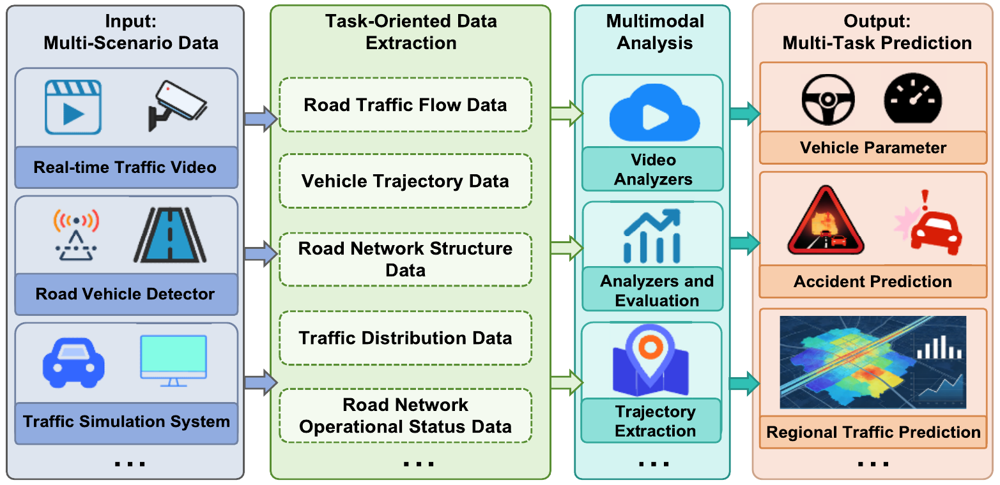
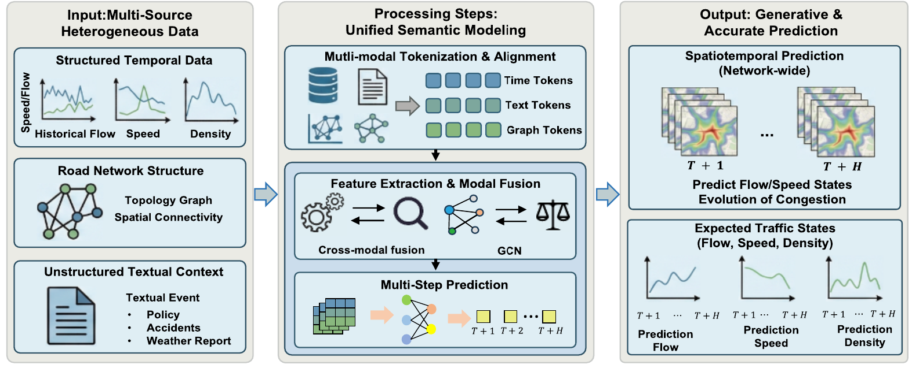

<div align="center">

# 🚦 Multimodal Large Language Models for Cross-Modal Spatiotemporal Transportation Prediction

[](https://www.python.org/downloads/release/python-3110/)
[](https://pytorch.org/)
[](https://opensource.org/licenses/MIT)
[]()

*An advanced Multimodal Large Language Model (MLLM) framework designed for cross-modal spatiotemporal transportation forecasting and digital twin reasoning.*

</div>

---

## 📌 Core Architecture

<p align="center">
  
  <br>
  <em><b>Figure 1:</b> Multimodal Large Language Models (MLLMs) paradigm shifting diverse input types into a unified semantic token space.</em>
</p>

### 🌐 Meso-Level Traffic Flow & Congestion Prediction

<p align="center">
  
  <br>
  <em><b>Figure 2:</b> Spatiotemporal flow estimation targeting road network operational states (flow, speed, and density).</em>
</p>

* **Multi-Scale Spatial Aggregation:** Bridges fine-grained **meso-level traffic flows** (sensor speeds/occupancy) with macro-level **travel demand** (zonal inflows/outflows) using explicit spatial mapping matrices ($A_{\text{meso} \rightarrow \text{macro}}$).
* **Cross-Modal Fusion:** Combines Spatial Graph Neural Networks (GNNs) with autoregressive Transformer backbones to align physical time-series and network topologies with natural language contexts.
* **Automatic Multi-Task Loss Balancing:** Implements **Kendall-Gal Homoscedastic Uncertainty Weighting** to automatically balance gradient magnitudes between flow and demand loss metrics.
* **Incident-Conditioned Forecasting:** Integrates unstructured text prompts (weather alerts, accident logs, POI descriptions) for non-recurrent congestion simulation.

---

## 🗂 Project Structure

```text
MLLMs project/
├── 📁 config/
│   └── 📄 config.yaml               # Master project configurations & hyperparams
├── 📁 data/
│   ├── 📁 raw/                      # Raw sensors, GIS shapefiles, & event text logs
│   └── 📁 processed/                # Pre-processed tensor feeds & graph matrices
├── 📁 src/
│   ├── 📁 data/
│   │   ├── 📄 dataset.py            # Multimodal spatiotemporal dataloader
│   │   └── 📄 spatial_aggregation.py# Meso-to-macro spatial mapping matrix (A_meso_macro)
│   ├── 📁 models/
│   │   ├── 📄 encoders.py           # Graph GNN & Time-series feature extractors
│   │   ├── 📄 backbone.py           # MLLM fusion backbone engine
│   │   └── 📄 multi_task_loss.py    # Kendall-Gal uncertainty loss module
│   └── 📁 utils/
│       └── 📄 metrics.py            # Evaluation metrics (MAE, RMSE, MAPE)
├── 📁 scripts/
│   └── 📄 train.py                  # End-to-end multi-task training script
├── 📁 notebooks/                    # Exploratory analysis & spatial visualizations
├── 📄 .gitignore                    # Version control exclusions
├── 📄 requirements.txt              # Project dependencies
└── 📄 README.md                     # Project documentation

```

---

## ⚡ Quick Start

### 1. Prerequisites & Environment Setup

Ensure you are using **Python 3.11**.

```bash
# Clone the repository
git clone [https://github.com/phamdps/MLLMs.git](https://github.com/phamdps/MLLMs.git)
cd MLLMs

# Create virtual environment using uv or conda
uv venv .venv
source .venv/bin/activate  # On Windows: .venv\Scripts\activate

# Install dependencies
pip install -r requirements.txt

```

### 2. Configuration

Adjust model hyper-parameters, data paths, and task settings in `config/config.yaml`:

```yaml
data:
  meso_sensor_nodes: 500
  macro_zones: 25
  history_steps: 12   # Past 1 hour (5-min resolution)
  pred_steps: 12      # Future 1 hour

training:
  batch_size: 32
  learning_rate: 1e-4
  epochs: 50

```

### 3. Training

Launch the multi-task joint prediction training pipeline:

```bash
python scripts/train.py --config config/config.yaml

```

---

## 📊 Task Scenarios Supported

| Level | Task Scenario | Description |
| --- | --- | --- |
| **Micro** | **Trajectory Prediction** | Next $(x,y)$ coordinate and agent-agent interaction modeling. |
| **Meso** | **Traffic Flow Prediction** | Network-wide speed, occupancy, and link volume forecasting. |
| **Macro** | **Travel Demand Prediction** | Origin-Destination (OD) matrix and zone-level inflow/outflow prediction. |
| **Cross-Scale** | **Multi-Task Joint Prediction** | Simultaneous flow and demand prediction constrained by spatial physical consistency. |

---

## 🚀 Recent Experiment & Inference Results

> **Model in Action:** Multi-camera surveillance and autonomous driving feeds processed via **Qwen2-VL-7B-Instruct** (4-bit VRAM-optimized mode) generating structured spatial-temporal reasoning blocks.

```json
{
  "perception": {
    "current_traffic_density": "Low",
    "congestion_level": "Low",
    "bottlenecks": [],
    "stalled_vehicles": [],
    "safety_hazards": []
  },
  "prediction": {
    "potential_trajectories": [
      {
        "vehicle": "ego_vehicle",
        "trajectory": "straight",
        "speed": "30 mph"
      },
      {
        "vehicle": "other_vehicle",
        "trajectory": "accelerate",
        "speed": "40 mph"
      }
    ]
  },
  "planning": {
    "recommendation": "Maintain current speed and trajectory. No immediate adjustments needed."
  }
}

```

---

## 🛡 License

Distributed under the **MIT License**. See `LICENSE` for more information.