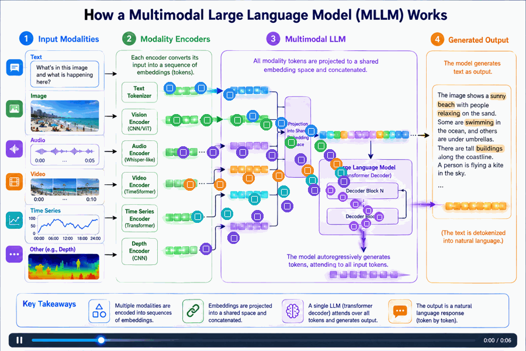
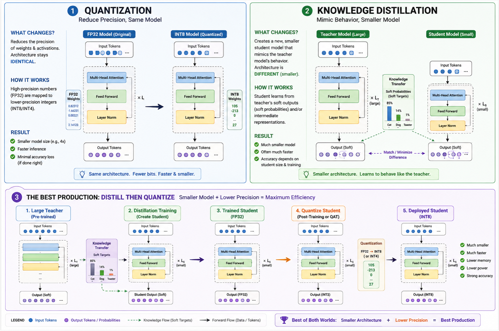
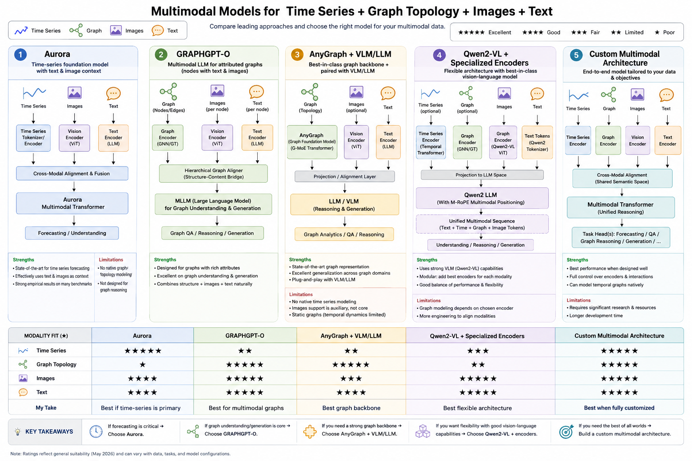
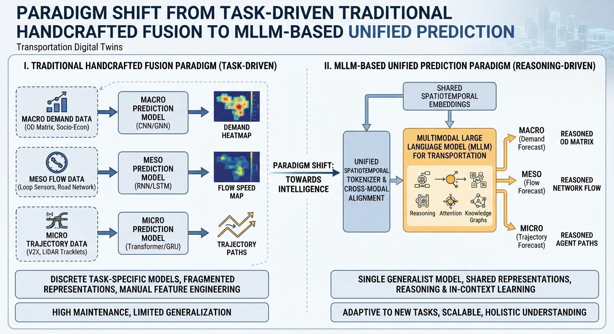
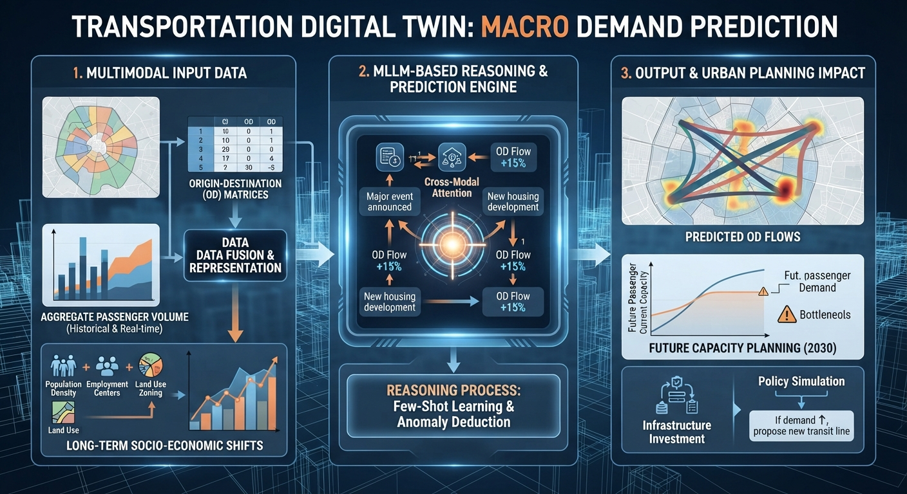
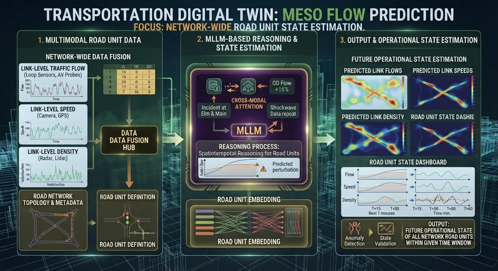
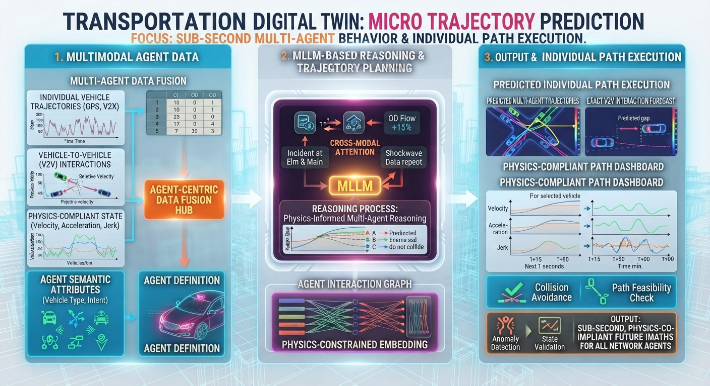
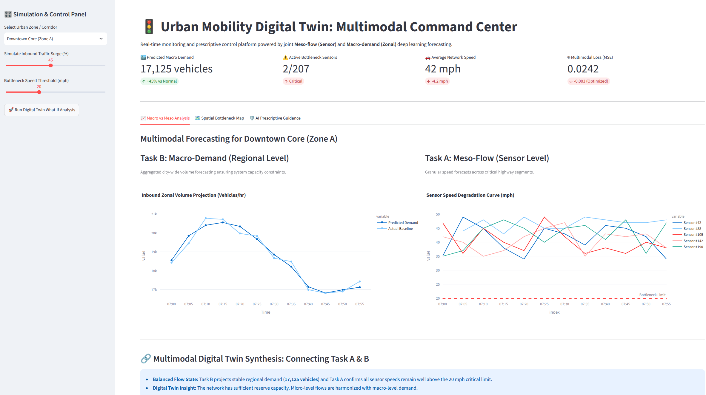

<div align="center">

# 🚦 Multimodal Large Language Models for Cross-Modal Spatiotemporal Transportation Prediction

[](https://www.python.org/downloads/release/python-3110/)
[](https://pytorch.org/)
[](https://opensource.org/licenses/MIT)
[]()

*An advanced Multimodal Large Language Model (MLLM) framework designed for cross-modal spatiotemporal transportation forecasting and digital twin reasoning.*

</div>

---

## 📚 Multimodal Architecture

<p align="center">
  
  <br>
  <em><b>Figure 1:</b> The visualization illustrates the complete architecture of the Extended Multimodal LLM, detailing the flow from heterogeneous inputs to the final natural language output.</em>
</p>

---

### 🌱 How Quantization and Distillation Complement Each Other

They target two completely different bottlenecks in an MLLM architecture:

1. **Knowledge Distillation (KD) reduces architectural size:**
* *What it does:* A large "teacher" MLLM trains a smaller "student" MLLM (e.g., distilling a massive 34B vision-language model down to a nimble 3B or 7B model) by mimicking its output token distributions and hidden representations.
* *The benefit:* Cuts down the actual parameter count ($N$), reducing layers and hidden dimensions. In MLLMs, distillation is also frequently used for **vision token compression** (learning how to pass fewer visual features from the vision encoder to the LLM backbone without losing semantic traffic details).


2. **Quantization reduces numerical precision:**
* *What it does:* Compresses the weight representations from high precision (FP16/BF16) down to lower bits (INT8, INT4, or even NF4).
* *The benefit:* Lowers memory bandwidth requirements. Since LLM and MLLM inference is heavily memory-bandwidth-bound during text generation, quantization drastically speeds up token generation per second.

When applied together, their savings **compound multiplicatively**. For instance, distilling a model to a tenth of its size and then applying INT4 quantization can reduce the final model memory footprint by up to 40×.

---

### 🌱 Typical Pipeline for MLLMs

<p align="center">
  
  <br>
  <em><b>Figure 2:</b> This diagram contrasts Knowledge Distillation (transferring knowledge from a large teacher MLLM to a compact student architecture) with Post-Training Quantization (reducing bit-width representation). Together, they enable sustainable, low-latency multimodal reasoning for real-time vehicular and traffic digital twin applications.</em>
</p>

Building an optimized pipeline for a transportation digital twin, the standard workflow looks like this:

* **Step 1: Multimodal Distillation.** Train a compact student MLLM using the outputs/logits and internal feature maps of a high-end teacher MLLM. Ensure the student retains spatial-temporal awareness (crucial for tracking vehicles, predicting traffic flows, or interpreting dashcam/infrastructure camera feeds).
* **Step 2: Post-Training Quantization (PTQ) or Quantization-Aware Training (QAT).** Once you have your compact student model, apply quantization methods like GPTQ, AWQ, or bitsandbytes to compress the weights down to INT4 or INT8.
* **Alternative (Quantization-Aware Distillation):** You can also quantize the teacher or train the student using quantization constraints directly to minimize accuracy drop.

---

## 🧠 Architecture Selection

Quantization and distillation are distinct from Neural Architecture Search (NAS) and network expansion techniques. While architectural methods dynamically alter or grow network layouts to improve performance, quantization and distillation work with fixed, pre-existing structures. Specifically, distillation trains a predetermined smaller student model using knowledge transfer, and quantization simply reduces the numerical precision of existing weights without changing the underlying architecture.

There is no universal model that handles text, time series, images, and graph topologies with equal native efficiency. Because each modality requires distinct mathematical structures and inductive biases—such as sequential semantics for text, temporal dynamics for time series, spatial grids for images, and relational structures for graphs—a one-size-fits-all architecture rarely delivers optimal performance.

<p align="center">
  
  <br>
  <em><b>Figure 3:</b> An Exploration of Multimodal Large Language Models for Modalities Prediction.</em>
</p>

Based on an exploration of modality prediction frameworks outlined in Figure 3, architecture selection usually be tailored to the target use case. If standard designs are insufficient, a custom model should be built from scratch using neural architecture search or network growth methodologies (for more details, visit the [greenmoo GitHub repository](https://github.com/phamdps/greenmoo)).

---

### Strategy Selection Based on Your Use Case

When designing or choosing a pipeline for your specific application, consider the following strategic directions:

* **The MLLM + Visual Rendering Approach:** For rapid prototyping or generalized reasoning, modern Multimodal Large Language Models (MLLMs) paired with visual encoding (such as rendering time series or graph topologies into visual plots) often provide the fastest path to implementation.
* **Modular Encoder-Decoder Architectures:** For heavy enterprise, financial, or scientific workloads (e.g., drug discovery or IoT telemetry), combining domain-specific front-ends—such as **Graph Neural Networks (GNNs)** for topology and **Vision Transformers (ViTs)** for images—fed into a shared embedding space yields superior domain-specific accuracy.
* **Custom Model Development:** If your use case requires high-precision joint reasoning across all four modalities simultaneously without losing structural nuance, you may need to **develop a novel custom multimodal architecture** tailored specifically to your data distribution.


---

## 📌 Overall Architectures

<p align="center">
  
  <br>
  <em><b>Figure 4:</b> Paradigm Shift from Traditional Handcrafted Fusion to MLLM-based Unified Prediction.</em>
</p>

---

### 🌐 Macro-Level Traffic Demand Prediction
<p align="center">
  
  <br>
  <em><b>Figure 5:</b> City-wide Origin-Destination (OD) matrix prediction, aggregating passenger volume and socio-economic shifts for urban planning.</em>
</p>

---

### 🌐 Meso-Level Traffic Flow & Congestion Prediction

<p align="center">
  
  <br>
  <em><b>Figure 6:</b> Spatiotemporal flow estimation targeting road network operational states (flow, speed, and density).</em>
</p>

---

### 🌐 Micro-Level Vehicle Trajectory Prediction
<p align="center">
  
  <br>
  <em><b>Figure 7:</b> Sub-second multi-agent behavior analysis, computing exact vehicle-to-vehicle interactions and physics-compliant individual path execution.</em>
</p>

---

### 🚦 Digital Twin Command Center Dashboard

<p align="center">
  
  <br>
  <em><b>Figure 8:</b> Interactive command center integrating multimodal forecasting, spatial bottleneck mapping, and AI prescriptive control.</em>
</p>


* **Multi-Scale Spatial Aggregation:** Bridges fine-grained **meso-level traffic flows** (sensor speeds/occupancy) with macro-level **travel demand** (zonal inflows/outflows) using explicit spatial mapping matrices ($A_{\text{meso} \rightarrow \text{macro}}$).
* **Cross-Modal Fusion:** Combines Spatial Graph Neural Networks (GNNs) with autoregressive Transformer backbones to align physical time-series and network topologies with natural language contexts.
* **Automatic Multi-Task Loss Balancing:** Implements **Kendall-Gal Homoscedastic Uncertainty Weighting** to automatically balance gradient magnitudes between flow and demand loss metrics.
* **Incident-Conditioned Forecasting:** Integrates unstructured text prompts (weather alerts, accident logs, POI descriptions) for non-recurrent congestion simulation.

---

## 🗂 Project Structure

```text
MLLM-Transportation-Digital-Twin/
│
├── 📁 assets/                       # Diagrams, figures, and visual assets
│   ├── FlowPrediction.png
│   ├── mllms.png
│   └── MLLMs.png
│
├── 📁 config/                       # Master project configurations & hyperparams
│   ├── 📄 config.yaml               # Global configurations (model, device, batch size)
│   └── 📁 tasks/                    # Task-specific hyperparameter configs
│       ├── 📄 flow_prediction.yaml
│       └── 📄 trajectory_prediction.yaml
│
├── 📁 data/                         # Data storage
│   ├── 📁 raw/                      # Raw sensors (METR-LA), GIS shapefiles, CCTV videos, event logs
│   ├── 📁 processed/                # Pre-processed tensor feeds & graph adjacency matrices
│   └── 📄 README.md
│
├── 📁 notebooks/                    # Jupyter notebooks for EDA, prototyping, & baselines
│   ├── 📄 01_data_exploration.ipynb
│   ├── 📄 02_Qwen2VL_baseline_METR_LA.ipynb  # Working Qwen2-VL baseline
│   └── 📄 03_multimodal_reasoning.ipynb
│
├── 📁 scripts/                      # Executable CLI entry points for pipeline execution
│   ├── 📄 download_data.py          # Data acquisition scripts
│   ├── 📄 train_model.py            # Unified end-to-end multi-task training script
│   ├── 📄 evaluate_reasoning.py     # Semantic evaluation & chain-of-thought metrics
│   ├── 📄 run_inference.py          # Streaming & real-time inference pipeline
│   └── 📄 test_data_pipeline.py     # Pipeline sanity checks
│
├── 📁 src/                          # Core modular source code
│   ├── 📁 agents/                   # Agent orchestration & prompt engineering
│   │   └── 📄 prompt_templates.py   # Instruction-tuning templates for CoT reasoning
│   ├── 📁 dataloader/               # Data loading & spatial aggregation
│   │   ├── 📄 dataset.py            # Multimodal spatiotemporal dataset loader
│   │   ├── 📄 metr_la_loader.py     # METR-LA sensor dataloader
│   │   ├── 📄 video_loader.py       # CCTV / intersection video frame loader
│   │   ├── 📄 text_event_loader.py  # Incident reports & weather log parser
│   │   └── 📄 spatial_aggregation.py# Meso-to-macro spatial mapping matrix (A_meso_macro)
│   ├── 📁 models/                   # Neural architectures & MLLM wrappers
│   │   ├── 📄 qwen2_vl_wrapper.py   # Core Qwen2-VL multimodal backbone
│   │   ├── 📄 encoders.py           # Graph GNN & Time-series feature extractors
│   │   ├── 📄 projectors.py         # Modality alignment adapters & projection layers
│   │   ├── 📄 prediction_heads.py   # Multi-task heads (flow regression, trajectory coords)
│   │   └── 📄 multi_task_loss.py    # Kendall-Gal uncertainty loss module
│   ├── 📁 simulation/               # Urban environment digital twin interaction
│   │   └── 📄 traffic_simulator.py  # Traffic simulator interface (e.g., SUMO)
│   ├── 📁 evaluation/               # Metrics and scoring modules
│   │   ├── 📄 metrics_numerical.py  # MAE, RMSE, MAPE, ADE, FDE calculation
│   │   └── 📄 metrics_semantic.py   # BLEU, ROUGE, & CoT reasoning validity scores
│   └── 📁 utils/                    # Helper utilities & logging
│       ├── 📄 metrics.py            # General evaluation wrappers
│       └── 📄 logger.py             # System logging configuration
│
├── 📁 xrefs/                        # Reference files, legacy notebooks, and older code
├── 📄 .gitignore                    # Version control exclusions
├── 📄 requirements.txt              # Project dependencies (transformers, torch, etc.)
└── 📄 README.md                     # Project documentation
```

---

## ⚡ Quick Start

### 1. Prerequisites & Environment Setup

Ensure you are using **Python 3.11**.

```bash
# Clone the repository
git clone [https://github.com/phamdps/MLLMs.git](https://github.com/phamdps/MLLMs.git)
cd MLLMs

# Create virtual environment using uv or conda
uv venv .venv
source .venv/bin/activate  # On Windows: .venv\Scripts\activate

# Install dependencies
pip install -r requirements.txt

```

### 2. Configuration

Adjust model hyper-parameters, data paths, and task settings in `config/config.yaml`:

```yaml
data:
  meso_sensor_nodes: 500
  macro_zones: 25
  history_steps: 12   # Past 1 hour (5-min resolution)
  pred_steps: 12      # Future 1 hour

training:
  batch_size: 32
  learning_rate: 1e-4
  epochs: 50

```

### 3. Training

Launch the multi-task joint prediction training pipeline:

```bash
python scripts/train.py --config config/config.yaml

```

---

## 📊 Task Scenarios Supported

| Level | Task Scenario | Description |
| --- | --- | --- |
| **Micro** | **Trajectory Prediction** | Next $(x,y)$ coordinate and agent-agent interaction modeling. |
| **Meso** | **Traffic Flow Prediction** | Network-wide speed, occupancy, and link volume forecasting. |
| **Macro** | **Travel Demand Prediction** | Origin-Destination (OD) matrix and zone-level inflow/outflow prediction. |
| **Cross-Scale** | **Multi-Task Joint Prediction** | Simultaneous flow and demand prediction constrained by spatial physical consistency. |

---

## 🚀 Recent Experiment & Inference Results

> **Model in Action:** Multi-camera surveillance and autonomous driving feeds processed via **Qwen2-VL-7B-Instruct** (4-bit VRAM-optimized mode) generating structured spatial-temporal reasoning blocks.

```json
{
  "perception": {
    "current_traffic_density": "Low",
    "congestion_level": "Low",
    "bottlenecks": [],
    "stalled_vehicles": [],
    "safety_hazards": []
  },
  "prediction": {
    "potential_trajectories": [
      {
        "vehicle": "ego_vehicle",
        "trajectory": "straight",
        "speed": "30 mph"
      },
      {
        "vehicle": "other_vehicle",
        "trajectory": "accelerate",
        "speed": "40 mph"
      }
    ]
  },
  "planning": {
    "recommendation": "Maintain current speed and trajectory. No immediate adjustments needed."
  }
}

```

---

# 📚 Reference & Reading List

#### 🌐 Open & Frontier Multimodal Foundation Models (Latest Flagship Releases)

* **Gemini 3.6 Flash & Gemini Omni (Google):** Google (2026), *[Introducing Gemini 3.6 Flash, 3.5 Flash-Lite, and 3.5 Flash Cyber](https://blog.google/innovation-and-ai/models-and-research/gemini-models/gemini-3-6-flash-3-5-flash-lite-3-5-flash-cyber/)* — Google's latest multimodal ecosystem featuring **Gemini Omni** (built for cross-modal video generation and conversational video editing) and **Gemini 3.6 Flash** (the flagship workhorse optimizing high-speed agentic execution, token efficiency, and advanced code reasoning).
* **Qwen2.5-VL (Alibaba):** Bai et al. (2025), *[Qwen2.5-VL Technical Report](https://arxiv.org/abs/2502.13923)* — Features native dynamic resolution processing, absolute time encoding for long-video localization up to hours, and advanced agentic computer/phone tool execution.
* **Llama 3.2 Vision (Meta):** Meta (2024), *[Llama 3.2: Instruct and Vision Models of 11B and 90B](https://docs.api.nvidia.com/nim/reference/meta-llama-3_2-11b-vision-instruct)* — Open-weights image-reasoning models utilizing dedicated cross-attention vision adapters built atop the Llama 3.1 architecture.
* **Phi-4-Multimodal (Microsoft):** Abdin et al. (2025), *[Phi-4-multimodal-instruct](https://huggingface.co/microsoft/Phi-4-multimodal-instruct)* — Lightweight native open multimodal architecture processing text, images, and speech input concurrently on a unified representation space.
* **Pixtral 12B (Mistral AI):** Mistral AI (2024), *[Pixtral 12B Technical Summary](https://arxiv.org/html/2410.07073v2)* — Open-weights model equipped with a custom-built vision encoder capable of ingesting arbitrary image resolutions and native aspect ratios within a 128K context window.
* **DeepSeek-VL2 (DeepSeek):** Wu et al. (2024), *[DeepSeek-VL2: Mixture-of-Experts Vision-Language Models for Advanced Multimodal Understanding](https://arxiv.org/abs/2412.10302)* — Advanced MoE vision-language architecture utilizing dynamic tiling for high-resolution document and image comprehension.
* **Grok-3 & Grok-4 Vision (xAI):** xAI (2025/2026), *[Grok-4 Technical Overview & RealWorldQA](https://x.ai/news)* — Frontier multimodal systems tightly integrated with real-time X data streams and advanced multi-step reasoning modes.
* **GPT-4o (OpenAI):** OpenAI (2024), *[Hello GPT-4o](https://openai.com/index/hello-gpt-4o/)* — Native omni-architecture trained across text, audio, and vision synchronously for real-time low-latency interaction.
* **Claude 3.5 Sonnet (Anthropic):** Anthropic (2024), *[Claude 3.5 Sonnet Release](https://www.anthropic.com/news/claude-3-5-sonnet)* — State-of-the-art vision-language model excelling in complex visual software engineering, dense chart analysis, and spatial reasoning.
* **ERNIE 5.0 / ERNIE-ViL (Baidu):** Baidu (2025/2026), *[ERNIE 5.0: Large-Scale Mixture-of-Experts Foundation Model](https://arxiv.org/abs/2602.04705)* — Billion-scale MoE architecture driving Baidu's multi-modal cross-domain text, visual, and autonomous driving intelligence.
* **Ollama & Local Execution Engines:** *[Ollama: Get up and running with Llama 3, Qwen 2, and other large language models locally](https://github.com/ollama/ollama)* — Framework enabling localized, privacy-compliant inference for edge-deployed digital twins.

#### 🚦 Intelligent Transportation Systems & LLM Operations (TSMO)

* **LLMs in Transportation Management:** Li et al. (2026), *[Large Language Models in Transportation Systems Management and Operations: From Text Reasoning to Multi-modal Decision Support](https://arxiv.org/abs/2606.00991)* — Comprehensive survey evaluating how Multi-modal Large Language Models (MM-LLMs) integrate heterogeneous text, sensor telemetry, incident reports, and visual observations into operator-facing decision support.
* **TrafficGPT (Agentic Traffic Control):** Zhang et al. (2024), *[TrafficGPT: Viewing, Capturing, and Responding to Traffic Chaos with LLM](https://arxiv.org/abs/2309.06719)* — Demonstrates how LLM agents interface with traffic simulators to manage complex urban intersections.
* **Multimodal LLM for ITS:** Al-Tameemi et al. (2024), *[Multimodal LLM for Intelligent Transportation Systems](https://arxiv.org/abs/2412.11683)* — Proposes a unified 3D MLLM framework evaluating sequential, audio, and visual sensor telemetry for intelligent transportation.
* **xTP-LLM (Explainable Traffic Forecasting):** Communications in Transportation Research (2024), *[Towards Explainable Traffic Flow Prediction with Large Language Models](https://arxiv.org/abs/2404.02937)* — Integrates multi-modal spatial-temporal data (Points of Interest, weather, historical logs) with Chain-of-Thought reasoning to generate accurate, interpretable traffic volume forecasts.
* **TraveLLM (Disruption-Aware Transit Routing):** Fang et al. (2024/2025), *[TraveLLM: Could You Plan My Public Transit Alternatives in Face of a Network Disruption?](https://arxiv.org/abs/2407.14926)* — Employs a two-stage LLM planner architecture to process natural language user constraints, live map data, and network disruption alerts for personalized alternative routing.
* **LC-LLM (Explainable Driving Behavior):** Peng et al. (2024/2025), *[LC-LLM: Explainable Lane-Change Intention and Trajectory Predictions with Large Language Models](https://arxiv.org/abs/2403.18344)* — Reformulates vehicle trajectory and lane-change intent forecasting as a language modeling problem, applying supervised fine-tuning and transparent step-by-step reasoning.

#### 📈 Time-Series, Geospatial, & Weather Foundation Models

* **Multimodal Information Fusion for Chart Understanding:** Yi et al. (2026), *[Multimodal Information Fusion for Chart Understanding: A Survey of MLLMs—Evolution, Limitations, and Cognitive Enhancement](https://arxiv.org/abs/2602.10138)* — Comprehensive 2026 taxonomy reviewing how MLLMs structurally fuse graphic data (like time series plots and topologies) with natural language.
* **Aurora (Multimodal TSFM):** Wu et al. (2025/2026), *[Aurora: Towards Universal Generative Multimodal Time Series Forecasting](https://arxiv.org/abs/2509.22295)* — Introduces modality-guided multi-head attention and prototype-guided flow matching for zero-shot time series synthesis.
* **HORAI (Frequency-Enhanced MFM):** Chen et al. (2026), *[Empowering Time Series Analysis with Large-Scale Multimodal Pretraining](https://arxiv.org/abs/2602.05646)* — Proposes a billion-scale multimodal time series corpus (MM-TS) leveraging endogenous images/text and exogenous news.
* **Earth Science Survey:** Zhao et al. (2026), *[Earth Science Foundation Models: From Perception to Reasoning and Discovery](https://arxiv.org/html/2605.12542v1)* — Comprehensive survey evaluating geospatial foundation models spanning perception, text reasoning, and agentic workflows.
* **GeoXplain Toolkit:** Koprolin et al. (2026), *[GeoXplain: On-the-Fly Visual Explanations for Weather Foundation Models](https://arxiv.org/abs/2607.05655)* — Interactive visual interpretation tool tailored for weather and climate foundation architectures like Microsoft Aurora.
* **Amazon Chronos:** Ansari et al. (2024), *[Chronos: Learning the Language of Time Series](https://arxiv.org/abs/2403.07815)* — Scaling tokenized scalar values into fixed vocabularies using language model architectures via cross-entropy loss.
* **ClimaX:** Nguyen et al. (2023), *[ClimaX: A foundation model for weather and climate](https://arxiv.org/abs/2301.10343)* — Flexible deep learning frameworks using custom tokenizers for geospatial grids.

---

## 🛡 License

Distributed under the **MIT License**. See `LICENSE` for more information.